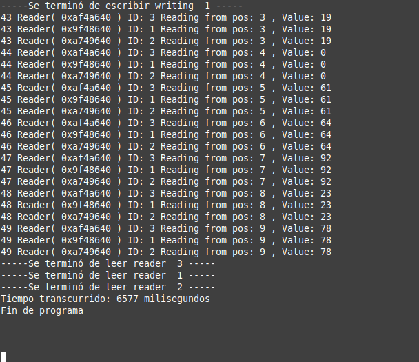

# Reader-Writer Problem

This project implements a basic solution to the classic **Reader-Writer** problem using **thread synchronization** in C++ with `std::thread`, `std::mutex`, and `std::condition_variable`.

## Features

- **One writer thread** that periodically updates a shared vector.
- **Three reader threads**, each performing a different computation:
  - **Reader 1:** Calculates the **mode** of the updated vector.
  - **Reader 2:** Calculates the **standard deviation**.
  - **Reader 3:** Calculates the **sum of all elements** multiplied by the **last read value**.
- Thread-safe access to the shared resource using mutexes and condition variables.
- Each reader maintains its own local copy of the shared data to avoid race conditions.
- Proper thread joining and termination handling.

---

## Example Output

Below is a screenshot showing typical runtime behavior of the threads during execution:

Each reader thread prints its progress while reading the shared vector, showing the position and value read. At the end, all readers report that they have finished, and the total elapsed time is printed.

---

## Valgrind Memory Check

Valgrind was used to ensure that the program does not leak memory. The report shows:

- No memory leaks (`definitely lost: 0 bytes`).
- All dynamically allocated memory is properly released.
